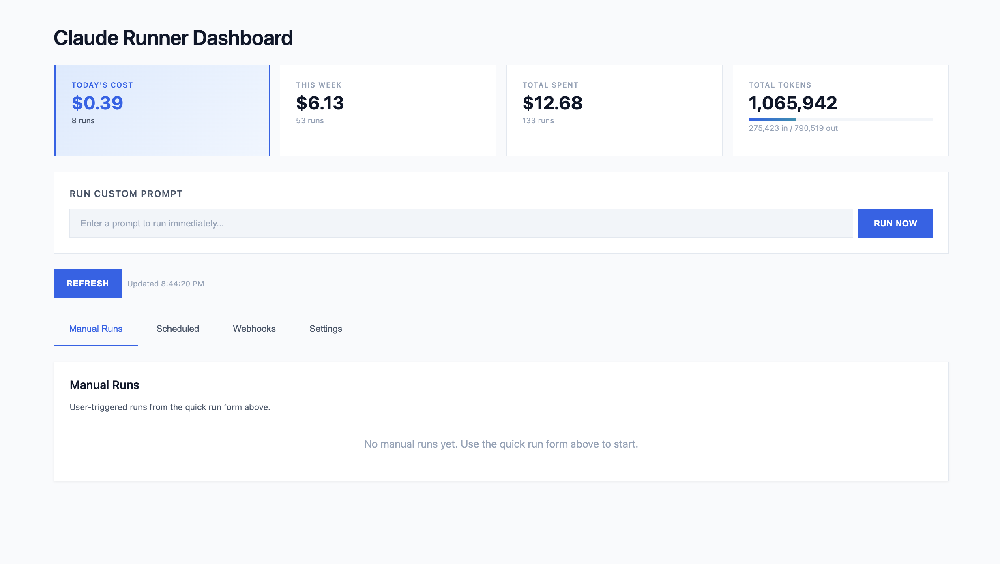

# Claude Runner - MCP Server with Job Scheduling

A single-file MCP server that schedules and executes AI tasks via cron expressions. Supports multiple AI providers — **Claude** (Agent SDK), **OpenAI**, and **Ollama/LM Studio** (any OpenAI-compatible local server). Features a web dashboard, webhook support, dynamic MCP server creation, and token/cost tracking.



## Prerequisites

- **Python 3.11+** (required for `asyncio.timeout()`)
- **SQLite3** (usually pre-installed on macOS/Linux)
- **At least one AI provider configured** (see below)

### Provider Setup

| Provider | Required Package | Required Env Var | Description |
|----------|-----------------|------------------|-------------|
| **Claude** | `claude-agent-sdk` | `ANTHROPIC_API_KEY` | Anthropic Claude via Agent SDK. API key from [console.anthropic.com](https://console.anthropic.com/) — do not use a personal Max/Pro subscription. |
| **OpenAI** | `openai` | `OPENAI_API_KEY` | OpenAI GPT models via the OpenAI API. |
| **Ollama** | `openai` | `OLLAMA_URL` | Any OpenAI-compatible local server (Ollama, LM Studio, vLLM, etc.). No API key needed for local inference. |

Providers are auto-detected at startup. Only providers with their package installed and required env vars set will be registered. The server works with any combination — you don't need all three.

## Quick Start

```bash
# Clone the repository
git clone https://github.com/floriansmeyers/SFLOW-AIRunner-MCP-PRD.git
cd SFLOW-AIRunner-MCP-PRD

# Create and activate virtual environment
python3 -m venv .venv
source .venv/bin/activate  # On Windows: .venv\Scripts\activate

# Install dependencies
pip install -r requirements.txt

# Run the server (stdio transport for Claude Desktop)
python server.py
```

On first run, the server will:
1. Create `jobs.db` SQLite database with all tables
2. Auto-generate OAuth credentials (printed to stderr - save these!)
3. Start the scheduler loop (checks every 60 seconds)

## Running

### Local (stdio transport - for Claude Desktop)

```bash
python server.py
```

Add to Claude Desktop config (`~/Library/Application Support/Claude/claude_desktop_config.json` on macOS):

```json
{
  "mcpServers": {
    "claude-runner": {
      "command": "/path/to/SFLOW-AIagents-MCP-Spinner/.venv/bin/python",
      "args": ["/path/to/SFLOW-AIagents-MCP-Spinner/server.py"]
    }
  }
}
```

**Important:** Use the full path to the Python interpreter inside your `.venv` to ensure dependencies are available.

### Remote (SSE transport - for web dashboard)

```bash
MCP_TRANSPORT=sse python server.py
# Server accessible at http://localhost:8080
# Web dashboard at http://localhost:8080/
```

### Both Transports

```bash
MCP_TRANSPORT=both python server.py
# stdio for Claude Desktop + SSE for web dashboard
```

## Environment Variables

### Provider Configuration

| Variable | Required | Default | Description |
|----------|----------|---------|-------------|
| `ANTHROPIC_API_KEY` | For Claude | - | API key from [console.anthropic.com](https://console.anthropic.com/) |
| `OPENAI_API_KEY` | For OpenAI | - | OpenAI API key |
| `OPENAI_MODEL` | No | `gpt-4o` | OpenAI model to use (e.g., `gpt-4o`, `gpt-4o-mini`, `o3`, `o4-mini`) |
| `OLLAMA_URL` | For Ollama | `http://localhost:11434` | URL of the OpenAI-compatible server (Ollama, LM Studio, vLLM, etc.) — `/v1` is appended automatically |
| `OLLAMA_MODEL` | No | `llama3.1` | Model to use on the local server |

### Server Configuration

| Variable | Required | Default | Description |
|----------|----------|---------|-------------|
| `MCP_TRANSPORT` | No | `both` | Transport mode: `stdio`, `sse`, or `both` |
| `OAUTH_CLIENT_ID` | No | auto-generated | OAuth client ID |
| `OAUTH_CLIENT_SECRET` | No | auto-generated | OAuth client secret |
| `OAUTH_SECRET_KEY` | No | auto-generated | Secret key for signing JWT tokens |
| `DASHBOARD_USERNAME` | No | - | Basic auth username for dashboard |
| `DASHBOARD_PASSWORD` | No | - | Basic auth password for dashboard |
| `NGROK_AUTHTOKEN` | No | - | ngrok auth token for remote tunneling |
| `PUBLIC_URL` | No | - | Override base URL for OAuth callbacks (e.g., `https://your-domain.com`) |

Create a `.env` file to persist these:

```env
# Provider keys (configure at least one)
ANTHROPIC_API_KEY=sk-ant-...
OPENAI_API_KEY=sk-...
OPENAI_MODEL=gpt-4o

# Local server (Ollama, LM Studio, etc.)
OLLAMA_URL=http://localhost:11434
OLLAMA_MODEL=llama3.1

# Server config
OAUTH_CLIENT_ID=your_client_id
OAUTH_CLIENT_SECRET=your_client_secret
OAUTH_SECRET_KEY=your_secret_key
DASHBOARD_USERNAME=admin
DASHBOARD_PASSWORD=secure_password
NGROK_AUTHTOKEN=your_ngrok_token
```

## Authentication (OAuth 2.1)

SSE transport requires OAuth 2.1 authentication. On first startup, the server auto-generates credentials and prints them to stderr:

```
============================================================
OAUTH CREDENTIALS FOR CLAUDE CONNECTOR
============================================================
Client ID:     abc123...
Client Secret: xyz789...

Save these to your .env file:
  OAUTH_CLIENT_ID=abc123...
  OAUTH_CLIENT_SECRET=xyz789...
============================================================
```

**Important:** Save these credentials immediately. The secret is only shown once and cannot be recovered.

### OAuth Endpoints

| Endpoint | Description |
|----------|-------------|
| `/.well-known/oauth-authorization-server` | Server metadata |
| `/.well-known/oauth-protected-resource` | Protected resource metadata |
| `/oauth/authorize` | Authorization endpoint |
| `/oauth/token` | Token endpoint |

### Regenerating Credentials

If you lose your credentials, delete the client from the database:

```bash
sqlite3 jobs.db "DELETE FROM oauth_clients WHERE client_name = 'Claude (auto)'"
```

Then restart the server to generate new credentials.

## Directory Structure

```
SFLOW-AIRunner-MCP-PRD/
├── server.py              # Main MCP server
├── requirements.txt       # Python dependencies
├── jobs.db               # SQLite database (auto-created)
├── .env                  # Environment variables (optional)
├── fixed-servers/        # Built-in MCP servers
│   └── email/
│       ├── server.py
│       └── metadata.json
├── dynamic_servers/      # User-created MCP servers (auto-created)
│   ├── cat-facts/
│   └── r2-images/
├── deploy/               # Deployment configs (systemd, nginx, deploy script)
│   ├── deploy.sh
│   ├── mcpserver.service
│   ├── nginx.conf
│   └── README-HETZNER.md
└── claude_playground/    # Working directory for job execution (auto-created)
```

## Database

SQLite database at `./jobs.db` with the following tables:

### Tables

| Table | Description |
|-------|-------------|
| `jobs` | Scheduled tasks with cron expressions |
| `runs` | Execution history with output, tokens, cost |
| `settings` | Configuration (allowed tools, MCP servers, credentials) |
| `webhooks` | HTTP endpoints that trigger prompts |
| `oauth_clients` | OAuth client credentials |
| `oauth_codes` | OAuth authorization codes |
| `oauth_refresh_tokens` | OAuth refresh tokens |

### Default Settings

On first run, these defaults are created:

| Key | Default Value |
|-----|---------------|
| `allowed_tools` | `["WebSearch", "WebFetch", "Read", "Write", "Edit", "Bash"]` |
| `mcp_servers` | `[]` |
| `mcp_env_vars` | `{}` |
| `webhook_base_url` | `"http://localhost:8080"` |
| `sandbox_mode` | `true` |

### Clean Reset

To completely reset the database:

```bash
rm jobs.db
python server.py  # Creates fresh database
```

## MCP Tools Available

### Job Management

| Tool | Description |
|------|-------------|
| `list_jobs` | List all scheduled jobs |
| `get_job(job_id)` | Get a specific job |
| `create_job(name, cron, prompt, ...)` | Create a new scheduled job |
| `update_job(job_id, ...)` | Update an existing job |
| `delete_job(job_id)` | Delete a job and its runs |
| `trigger_job(job_id)` | Manually trigger a job now |

### Run Management

| Tool | Description |
|------|-------------|
| `list_runs(job_id?, limit?)` | List recent runs |
| `get_run(run_id)` | Get full run details including output |
| `kill_run(run_id)` | Cancel a pending/running run |

### Webhooks

| Tool | Description |
|------|-------------|
| `create_webhook(name, prompt_template)` | Create a webhook endpoint |
| `list_webhooks` | List all webhooks |
| `get_webhook(webhook_id)` | Get webhook details |
| `update_webhook(webhook_id, ...)` | Update a webhook |
| `delete_webhook(webhook_id)` | Delete a webhook |

### Dynamic MCP Servers

| Tool | Description |
|------|-------------|
| `create_mcp_server(name, code, ...)` | Create a custom MCP server |
| `list_dynamic_mcp_servers` | List user-created servers |
| `get_dynamic_mcp_server(name)` | Get server details |
| `update_mcp_server(name, code, ...)` | Update a dynamic server's code/description |
| `delete_mcp_server(name)` | Delete a dynamic server |
| `enable_mcp_server(name)` | Enable a dynamic MCP server |
| `disable_mcp_server(name)` | Disable a dynamic MCP server |

### Fixed MCP Servers

| Tool | Description |
|------|-------------|
| `list_fixed_mcp_servers` | List built-in servers |
| `enable_fixed_server(name)` | Enable a fixed server |
| `disable_fixed_server(name)` | Disable a fixed server |

### Internal MCP Tools

| Tool | Description |
|------|-------------|
| `invoke_internal_mcp_tool(tool, payload)` | Invoke a tool on an internal MCP server |

### Credentials

| Tool | Description |
|------|-------------|
| `set_server_credential(server, key, value)` | Set a credential |
| `get_server_credentials(server)` | View credentials (masked) |
| `list_required_credentials(server)` | See required credentials |
| `get_unconfigured_servers` | Find servers missing credentials |
| `delete_server_credential(server, key)` | Delete a credential |

## Usage via claude.ai

Once connected, you interact with the server entirely through natural language. Claude translates your requests into the appropriate MCP tool calls behind the scenes.

**Note on providers:**
- **Claude** provider requires the Claude Agent SDK, which runs the local Claude Code CLI. You need [Claude Code](https://docs.anthropic.com/en/docs/claude-code) installed and authenticated (`claude` on the system PATH) on the machine running the server.
- **OpenAI** provider requires an `OPENAI_API_KEY` env var.
- **Ollama** provider works with any OpenAI-compatible local server (Ollama, LM Studio, vLLM, etc.) — set `OLLAMA_URL` to point to your server.

Below are the main workflows.

### Creating Custom Tools

You can ask Claude to build new MCP tool servers on the fly. The server code is saved to `dynamic_servers/<name>/` and each server gets a `DATA_DIR` path variable for local file storage. Environment variables referenced via `os.environ.get()` or `os.getenv()` in the code are auto-detected and marked as required credentials.

```
You: Create a tool that fetches the current weather for a given city using the
     OpenWeatherMap API.

Claude: [calls create_mcp_server — saves server to dynamic_servers/weather/,
         detects OPENWEATHERMAP_API_KEY from code]
  Done! I created the "weather" server with a get_weather(city) tool.
  It needs an API key — want me to store yours now?

You: Yes, the key is abc123

Claude: [calls set_server_credential("weather", "OPENWEATHERMAP_API_KEY", "abc123")]
  Credential saved. The weather server is ready to use.
```

### Scheduling Recurring Jobs

Jobs run on cron schedules. You can specify which provider to use via the `command` field (`"claude"`, `"openai"`, or `"ollama"`) and which tools the job is allowed to use (empty array `[]` means all tools).

```
You: Create a job that runs every weekday at 9am to summarize our Azure DevOps sprint,
     using OpenAI

Claude: [calls create_job with:]
  name: "Daily Sprint Summary"
  cron: "0 9 * * 1-5"
  prompt: "Connect to Azure DevOps and summarize the current sprint..."
  command: "openai"
  tools: ["mcp__azure-devops__wit_my_work_items", "mcp__email__send_email"]
  Job created (id: a1b2c3d4). Next run: tomorrow at 9:00 AM.

You: Show me the last 5 runs

Claude: [calls list_runs with limit=5]
  Here are the recent runs — 4 completed successfully, 1 errored out...
```

### Setting Up Webhooks

Webhooks let external services trigger a prompt via HTTP POST. The `prompt_template` supports `{{payload}}` for the full body or `{{payload.field.subfield}}` for nested values. Each webhook can have its own `command` to select which provider processes it.

```
You: Create a webhook that sends a Slack summary whenever a new Azure DevOps
     work item is created, using the local Ollama model. The POST body will have
     the item title at resource.fields.System.Title.

Claude: [calls create_webhook with:]
  name: "New Work Item Notifier"
  command: "ollama"
  prompt_template: "A new work item was created: {{payload.resource.fields.System.Title}}.
                    Summarize it and post to Slack."
  Webhook created! POST to this URL to trigger it:
  https://your-server.com/webhook/abc123def456...

You: Test it — trigger the webhook manually

Claude: I can't trigger webhooks via MCP, but you can test with curl:
  curl -X POST https://your-server.com/webhook/abc123def456... \
    -H "Content-Type: application/json" \
    -d '{"resource":{"fields":{"System":{"Title":"Bug: login broken"}}}}'
```

### Invoking Tools Directly

Use `invoke_internal_mcp_tool` to call a tool on any enabled MCP server immediately, without creating a job.

```
You: Use the weather tool to check the forecast in Berlin

Claude: [calls invoke_internal_mcp_tool with:]
  tool: "mcp__weather__get_weather"
  payload: {"city": "Berlin"}
  Currently 12°C and cloudy in Berlin, with rain expected this afternoon.
```

### Managing Servers & Credentials

You can enable, disable, and update both built-in (fixed) and user-created (dynamic) servers, and manage their credentials.

```
You: What servers are available?

Claude: [calls list_fixed_mcp_servers and list_dynamic_mcp_servers]
  Fixed servers: email (enabled), playwright (disabled)
  Dynamic servers: weather (enabled), url-shortener (disabled)

You: Enable playwright and disable the weather server

Claude: [calls enable_fixed_server("playwright") and disable_mcp_server("weather")]
  Done — playwright is now enabled and weather is disabled.

You: Which servers are missing credentials?

Claude: [calls get_unconfigured_servers]
  The email server needs SENDGRID_API_KEY and SENDER_EMAIL.
```

### Ad-hoc Prompts

For one-off tasks, use the **Quick Run** feature in the web dashboard (SSE mode) to execute a prompt immediately without creating a job. The Quick Run form includes a provider dropdown to select which AI model processes the prompt. From claude.ai, you can also manually trigger any existing job:

```
You: Run the "Daily Sprint Summary" job right now

Claude: [calls trigger_job("a1b2c3d4")]
  Run queued (run_id: e5f6g7h8). I'll check back for results.
```

## Cron Examples

| Expression | Description |
|------------|-------------|
| `0 9 * * 1-5` | Weekdays at 9:00 AM |
| `0 */2 * * *` | Every 2 hours |
| `0 9 * * 1` | Mondays at 9:00 AM |
| `*/30 * * * *` | Every 30 minutes |
| `0 0 1 * *` | First day of month at midnight |

## Troubleshooting

### ModuleNotFoundError: No module named 'dotenv'

Claude Desktop is using system Python instead of your venv. Update your config to use the full venv path:

```json
{
  "command": "/full/path/to/.venv/bin/python",
  "args": ["/full/path/to/server.py"]
}
```

### OAuth credentials lost

Delete the auto-generated client and restart:

```bash
sqlite3 jobs.db "DELETE FROM oauth_clients WHERE client_name = 'Claude (auto)'"
python server.py  # New credentials printed to stderr
```

### Jobs not running

1. Check the scheduler is running (look for "Scheduler loop started" in logs)
2. Verify job is enabled: `sqlite3 jobs.db "SELECT enabled FROM jobs"`
3. Check cron expression is valid
4. Look for errors in runs: `sqlite3 jobs.db "SELECT error FROM runs ORDER BY started_at DESC LIMIT 1"`

### MCP tools not available in jobs

If a job reports "I don't have access to [MCP server] tools", check the tool name format:

**Correct format:** `mcp__<server>__<tool>` (double underscores)
- Example: `mcp__email__send_email`
- Example: `mcp__playwright__navigate`

**Auto-normalized formats:** These are automatically converted:
- `email:send_email` → `mcp__email__send_email`
- `email.send_email` → `mcp__email__send_email`

**Tip:** Use an empty tools array `[]` to allow all available tools, or check the response for `tool_warnings` to see if any tools were normalized.

### Server disconnects immediately

Check stderr output for errors. Common causes:
- Missing dependencies (run `pip install -r requirements.txt`)
- Python version < 3.11
- Database locked by another process

### Git "dubious ownership" error

If auto-deploy fails with "fatal: detected dubious ownership in repository":

```bash
git config --system --add safe.directory /opt/mcpserver/app
```

This happens when the repository is owned by a different user than the one running the deploy script.

### Playwright browser not found

If Playwright fails with browser not found errors, install Chromium manually:

```bash
# Install system dependencies first (as root) - Ubuntu 24.04
apt install -y libnss3 libnspr4 libatk1.0-0t64 libatk-bridge2.0-0t64 libcups2t64 \
  libxkbcommon0 libxcomposite1 libxdamage1 libxfixes3 libxrandr2 libgbm1 \
  libpango-1.0-0 libcairo2 libasound2t64

# Then install browser (as application user)
su - mcpuser
cd /opt/mcpserver/app
source venv/bin/activate
playwright install chromium
```

Verify it works:
```bash
python -c "from playwright.sync_api import sync_playwright; p = sync_playwright().start(); b = p.chromium.launch(); print('OK'); b.close(); p.stop()"
```

## Architecture

```
┌──────────────────────────────────────────────────────────────┐
│                        MCP Server                            │
│  ┌───────────┐  ┌───────────────┐  ┌───────────────────┐    │
│  │ Job CRUD  │  │   Scheduler   │  │   Run Processor   │    │
│  │  Tools    │  │  (60s loop)   │  │     (async)       │    │
│  └─────┬─────┘  └───────┬───────┘  └─────────┬─────────┘    │
│        │                │                     │              │
│        └────────────────┼─────────────────────┘              │
│                         ▼                                    │
│                ┌────────────────┐                             │
│                │    SQLite      │                             │
│                │   (jobs.db)    │                             │
│                └────────┬───────┘                             │
│                         ▼                                    │
│              ┌─────────────────────┐                         │
│              │  Provider Registry  │                         │
│              └──┬────────┬──────┬──┘                         │
│                 ▼        ▼      ▼                            │
│  ┌──────────┐ ┌────────┐ ┌───────────────┐                  │
│  │  Claude   │ │ OpenAI │ │ Ollama/Local  │                  │
│  │Agent SDK  │ │  API   │ │ (LM Studio,..)│                  │
│  └──────────┘ └────────┘ └───────────────┘                  │
└──────────────────────────────────────────────────────────────┘
```

The server runs three concurrent async components:
1. **MCP Server** - Exposes 25+ tools via FastMCP
2. **Scheduler Loop** - Checks every 60 seconds for jobs due based on cron
3. **Run Processor Loop** - Picks up pending runs and dispatches to the selected provider

### Provider System

The `command` field on jobs, webhooks, and ad-hoc runs selects which AI provider processes the task. Providers are registered at startup based on available packages and env vars.

| Provider | `command` value | MCP Tool Support | Cost Tracking |
|----------|----------------|------------------|---------------|
| Claude | `"claude"` | Native via Agent SDK | Full (input/output/cache tokens) |
| OpenAI | `"openai"` | Converted to function calling | Full (input/output tokens) |
| Ollama | `"ollama"` | Converted to function calling | Free (local inference) |

MCP tools from enabled servers are automatically converted to each provider's native function-calling format. Server credentials (stored in the DB via `set_server_credential`) are injected into the environment during tool loading so that all providers — including OpenAI and Ollama which import modules in-process — can access them. The OpenAI and Ollama providers run an agentic tool loop (up to 20 iterations) to handle multi-step tool use.

## REST API

The server exposes a REST API (SSE mode) for external integrations:

| Endpoint | Method | Description |
|----------|--------|-------------|
| `/api/providers` | GET | List registered providers and their capabilities |
| `/api/run` | POST | Execute an ad-hoc prompt (`{prompt, command?}`) |
| `/api/jobs` | GET/POST | List or create jobs |
| `/api/job/{id}` | GET/PUT/DELETE | Get, update, or delete a job |
| `/api/job/{id}/trigger` | POST | Trigger a job run |
| `/api/runs` | GET | List runs |
| `/api/run/{id}` | GET | Get run details |
| `/api/webhooks` | GET | List webhooks |
| `/api/webhook/{id}/provider` | PUT | Update a webhook's provider |

## Key Dependencies

- `fastmcp` - MCP protocol implementation
- `claude-agent-sdk` - Claude provider execution engine
- `openai` - OpenAI and Ollama/local provider execution (optional)
- `croniter` - Cron expression parsing
- `sendgrid`, `requests` - Email provider integrations
- `uvicorn` - ASGI server for SSE transport
- `pyngrok` - ngrok tunnel for remote access from claude.ai
- `python-dotenv` - `.env` file loading
- `PyJWT` - JWT token handling for OAuth
- `beautifulsoup4` - Web scraping
- `boto3` - AWS integration
- `playwright` - Browser automation
